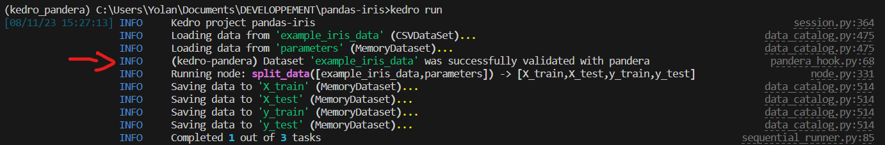
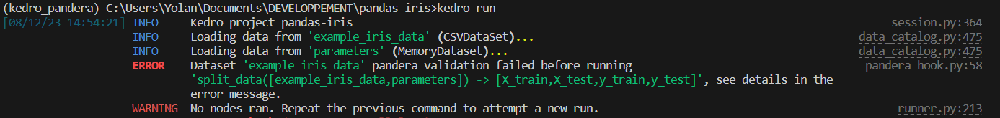
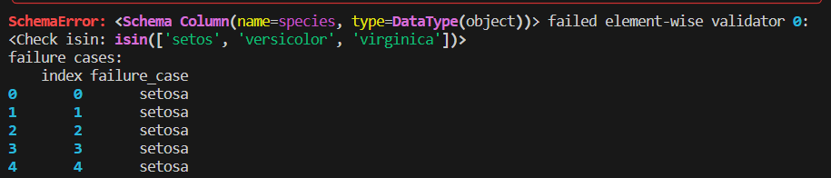

# Tutorial

## Introduction

## Pre-requisite

### Create a virtual environment

It is recommended to create a virutal environment to install your packages. You can install ``kedro-pandera`` from PyPI.
```bash
conda create -n kedro-pandera-tutorial python=3.10 -y
conda activate kedro-pandera-tutorial
pip install kedro-pandera
```

Notice that installing ``kedro-pandera`` will automatically install ``kedro``.

```{important}
``kedro-pandera`` only works with ``kedro>=0.18.13``. You may need to upgrade your kedro version if you are using it in an older project.
```

### Create the project

We will use the ``pandas-iris`` [kedro starter](https://github.com/kedro-org/kedro-starters/tree/main/pandas-iris) in this tutorial. First, we create a project from this starter:

```bash
kedro new --starter=pandas-iris
```

Press enter for each question to have default settings.

### Configure the project

```{note}
In ``kedro>=0.19``, ``OmegaConfigLoader`` will become the default and this will step no longer be necessary.
```


If you are using  ``kedro>=0.18.13, <0.19``, you need to configure your ``settings.py`` to use the ``OmegaConfigLoader``: which is the only ``ConfigLoader``  compatible with ``kedro-pandera``.

```python
# settings.py
from kedro.config import OmegaConfigLoader

CONFIG_LOADER_CLASS = OmegaConfigLoader
```


```{note}
In ``kedro>=0.19``, ``OmegaConfigLoader`` will be the default and this will step no longer be necessary.
```

## Validating data at runtime

### Goal of the tutorial

This tutorial focuses on how ``kedro-pandera`` can help to validate data at runtime to ensure they meet some data quality requirements (data schema, column types, value range...).

```{warning}
Data will be validated every time you use ``kedro run`` command. This may come with some performance penalty.
```

In our example the pipeline will "train an example machine learning pipeline that runs a 1-nearest neighbour classifier to classify an iris" [according to the documentation](https://github.com/kedro-org/kedro-starters/tree/main/pandas-iris).

We want to add checks make sure that the input dataset will not vary too much during future retraining on new data. Hence, we will validate ``example_iris_data``  with pandera.

### Step 1: Generate the schema

Writing a configuration file for validation is long and not easy to do manually, so we will generate a default schema as a baseline witht the ``kedro-pandera`` CLI ``infer`` command:

```bash
kedro pandera infer -d example_iris_data
```
You should see the following message:

```bash
[08/09/23 15:24:01] INFO     Loading data from 'example_iris_data' (CSVDataset)...                                                  data_catalog.py:475
The schema is written to /path/to/project/pandas-iris/conf/base/catalog_example_iris_data.yml
```

This will create a file ``/path/to/project/pandas-iris/conf/base/catalog_example_iris_data.yml`` with the default configuration.

```{warning}
This CLI is a helper to avoid you to write the schema manually which is tedious but the documentation clearly states that "_these inferred schemas are **rough drafts** that shouldn’t be used for validation without modification_" (https://pandera.readthedocs.io/en/stable/schema_inference.html)
```

### Step 2: Update the catalog

```yaml
example_iris_data:
  type: pandas.CSVDataset
  filepath: data/01_raw/iris.csv
  metadata:
    pandera:
      schema: ${pa.yaml:_example_iris_data_schema}
```

```{note}
``pa.yaml`` is a special syntax from [``OmegaConf``](https://omegaconf.readthedocs.io/en/2.3_branch/#) called a ["custom resolver"](https://omegaconf.readthedocs.io/en/2.3_branch/custom_resolvers.html#custom-resolvers). This resolver is created by ``kedro_pandera`` and simultaneously:
- replace the ``_example_iris_data_schema`` key by its value (it should exist in the)
- convert the result from a ``dict`` to a pandera ``DataFrameSchema`` object
```


### Step 3: Run the pipeline and see the validation passing

Before we look at the configuration file and customize it, let's run the pipeline:

```bash
kedro run
```

If you look carefully at the logs, you will notice a new message which indicates that the ``example_iris_data`` was succesfully validated.



What actually happened under the hood is that ``kedro-pandera`` performed all the checks described in the ``_example_iris_data_schema`` key in ``/path/to/project/pandas-iris/conf/base/catalog_example_iris_data.yml``.

### Step 4: Customize checks

First, let's look at the auto generated yaml file. Note that this is an helper because generating the file manually is tedious, but it should be modified manually to add the checks we want:

```{tip}
You can check the [pandera official documentation](https://pandera.readthedocs.io/en/stable/dataframe_schemas.html) to understand the entries in the generated yaml file.
```


```yaml
# /path/to/project/pandas-iris/conf/base/catalog_example_iris_data.yml

_example_iris_data_schema:
  schema_type: dataframe
  version: 0.16.1
  columns: # see all entries here: https://pandera.readthedocs.io/en/stable/reference/generated/pandera.api.pandas.components.Column.html
    sepal_length: # first column
      title: null
      description: null
      dtype: float64
      nullable: false
      checks:
        greater_than_or_equal_to: 4.3
        less_than_or_equal_to: 7.9
      unique: false
      coerce: false
      required: true
      regex: false
    ... # add as many other columns as you have in your dataframe
    species:
      title: null
      description: null
      dtype: object
      nullable: false
      checks: null
      unique: false
      coerce: false
      required: true
      regex: false
  checks: null
  index:
  - title: null
    description: null
    dtype: int64
    nullable: false
    checks:
      greater_than_or_equal_to: 0.0
      less_than_or_equal_to: 149.0
    name: null
    unique: false
    coerce: false
  #dataframe level entries: https://pandera.readthedocs.io/en/stable/reference/generated/methods/pandera.api.pandas.container.DataFrameSchema.__init__.html
  dtype: null
  coerce: true
  strict: false
  name: null
  ordered: false
  unique: null
  report_duplicates: all
  unique_column_names: false
  add_missing_columns: false
  title: null
  description: null

...
```

We want to add a check on the "species" column of our dataset to ensure it can only takes values in the list ``["setosa", "versicolor", "virginica"]``

```yaml
_example_iris_data_schema:
  schema_type: dataframe
  version: 0.16.1
  columns:
    ...
    species:
      title: null
      description: null
      dtype: object
      nullable: false
      checks:
        isin: ["satosa", "versicolor", "virginica"] # <-added, notice the mistake in "setosa" -> "satosa"
      unique: false
      coerce: false
      required: true
      regex: false
  checks: null
  ...
```


```{tip}
You can find all built-in checks avalaible in ``pandera`` in the [Check API documentation](https://pandera.readthedocs.io/en/stable/reference/generated/pandera.api.checks.Check.html).
```

```{warning}
[Custom checks](https://pandera.readthedocs.io/en/stable/dataframe_models.html?#custom-checks) and [hypothesis tests](https://pandera.readthedocs.io/en/stable/hypothesis.html) require you using the [python API with Dataframe Model](./02_dataframe_model.md)
```

### Step 5: Run the pipeline and see it fail

Let's run kedro again and see what's happening :

```bash
kedro run
```

We see the following error:




We have the index, the row and the example that fail, as well as the name of the failing dataset (in the "ERROR" log message). We can correct our config file:

```yaml
_example_iris_data_schema:
  schema_type: dataframe
  version: 0.16.1
  columns:
    ...
    species:
      title: null
      description: null
      dtype: object
      nullable: false
      checks:
        isin: ["setosa", "versicolor", "virginica"] # <-corrected list
      unique: false
      coerce: false
      required: true
      regex: false
  checks: null
  ...
```

If we run the pipeline again with ``kedro run``, we will see the same successful log we saw in step 3!

Congratulations, your pipeline is now protected against invalid values passed to the "species" column!

```{note}
If you prefer to use the `pandera` class-based [DataFrameModel schema](https://pandera.readthedocs.io/en/stable/dataframe_models.html), you can refer to [Validate with DataFrameModel](./02_dataframe_model.md) to create the schema and update the data catalog.
```
